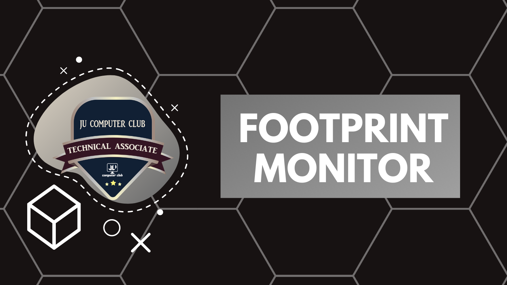

# Footprint Monitor

## Progress Tracker platform for **JUCOM Technical Associates Program** for **January Cohort**

## 🎯 Team Members 

- Anjum Rashid - [@bijoy26](https://www.github.com/bijoy26) 
- Meraj Al Maksud - [@merajmasuk](https://www.github.com/merajmasuk) 

## 🎯 Quick Links
- ### 📻 Group Discussion Records - [Google Drive]()
    - [Meeting-1 : Introduction (DATE)](https://drive.google.com/file/d/19WsHy81XhaqlGanaXUhymXkBuuHWGiae/view?usp=sharing)
    - [Meeting-2 : Quick Status Check (DATE)](#)
    - [Upcoming](#)
    - [Upcoming](#)

- ### Individual Progress Logs 
    - [bijoy26](#)
    - [merajmasuk](#)
    
- ### Associate Profile Template - [To Be Added](#)

## 🎯 Goals:
- Gather & Showcase your skills
- Teamwork on project initiatives
- Mentorship Engagements
- Technical Profile Builup
- Program Opportunities
- Adopt **Learn-and-teach** method 

## 🎯 Requirements
:small_blue_diamond: Sharing mentality: You need to share your findings and afterwords maybe discuss or teach how those things work  
:small_blue_diamond: Maintain progress: Commit at least 8-10 hours every week to learn and implement a new topic/tool/strategy  
:small_blue_diamond: Configuration: Configure your environment/machine according to the requirements needed (i.e. VM installation, Network tweaking)  
:small_blue_diamond: Documentation: Write down everything you do in a simple but organized way (bonus for using markdown)

## 🎯 Platforms
- **Team Communication:** Discord Server
- **Team Management:** Github Teams
- **Resource Management:** GitHub Repository

## 🎯 Expectations
:small_orange_diamond: Showcase your technical expertise through speaking on webinars and technical workshops arranged by JU Computer Club
:small_orange_diamond: Learn Open Source contribution by taking part in tech projects undertaken by JU Computer Club
:small_orange_diamond: Use your mentorship opportunity to closely work with upcoming pilot programs undertaken by the club
:small_orange_diamond: Make proper use of the exclusive benefits that we offer and try you best to achieve the Best Performing Associate recognition

## 🎯 Aftermath
### After program completion, based on your activities and contribution, you would be able to-
- Get evaluation on your *6 months progress log* 
- Track down your obtained skills and achievements
- Prepare a simple *individual report* on your skill growth based on your learning curve
- Update your Resume / LinkedIn / CV based on the skills and experiences learned with teamwork and mentorship.
- Get rewarded with verifiable Digital Badge based on your program contribution
- If interest persists, you can keep your engagements with JU Computer Club even after that

## 🎯 About Technical Associates Program
Program Details

